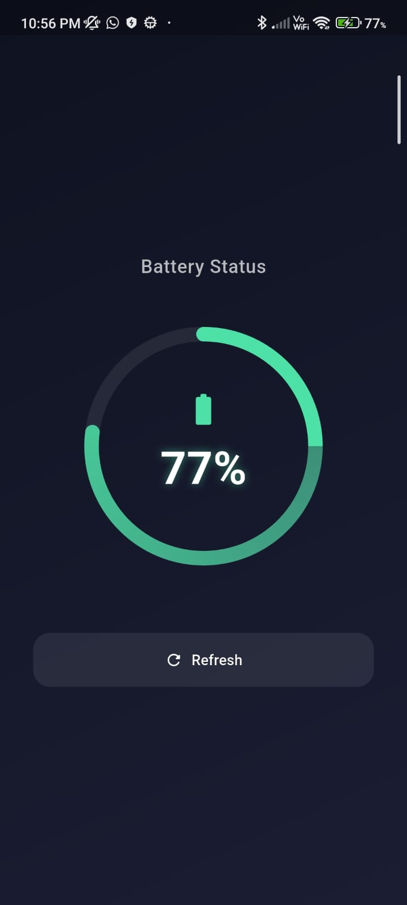

# flutter_native_battery_level

A Flutter plugin for retrieving the native device battery level on Android and iOS using Method Channels.

## Features

- ✅ Android support
- ✅ iOS support
- ✅ Native platform integration
- ✅ Simple API

## Installation

Add the dependency to your `pubspec.yaml`:

```yaml
dependencies:
  flutter_native_battery_level: ^0.1.1
````

## Usage

Import the package:

```dart
import 'package:flutter_native_battery_level/flutter_native_battery_level.dart';
```

Create an instance of the plugin and retrieve the battery level:

```dart
final batteryLevel = FlutterNativeBatteryLevel();

Future<void> getBatteryLevel() async {
  try {
    final int? level = await batteryLevel.getBatteryLevel();
    print('Battery Level: $level%');
  } catch (e) {
    print('Failed to get battery level: $e');
  }
}
```


## 📸 Screenshots


